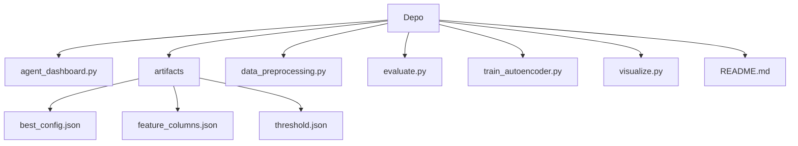

# Siber Güvenlik Ajani: CICIDS2017 Anomali Tespiti

Bu proje, ağ trafiğindeki siber saldırı anomalilerini tespit etmek ve tespit anında otonom aksiyonlar alabilmek için tasarlanmış bir siber güvenlik ajanıdır. CICIDS2017 veri seti kullanılarak geliştirilen bu ajan, yalnızca normal trafik örnekleri ile eğitilmiş bir Yoğun Otomatik Kodlayıcı (Dense Autoencoder) yaklaşımı benimser. Hedef kullanıcılar, ağ güvenliği analistleri ve araştırmacılardır. Proje, imza tabanlı sistemlerin yetersiz kaldığı bilinmeyen saldırılara karşı bir prototip çözümü sunarken, tespit edilen tehditlere karşı otomatik (simüle edilmiş) IP bloklama yeteneği ile operasyonel bir güvenlik ajanı davranışı sergiler.

## İçindekiler
* [Özet](#özet)
* [Özellikler](#özellikler)
* [Gereksinimler](#gereksinimler)
* [Kurulum ve çalıştırma](#kurulum-ve-çalıştırma)
* [Yapılandırma](#yapılandırma)
* [Kullanılan teknolojiler](#kullanılan-teknolojiler)
* [Mimari ve klasör yapısı](#mimari-ve-klasör-yapısı)
* [API veya uç noktalar](#api-veya-uç-noktalar)
* [Test ve kalite](#test-ve-kalite)
* [Dağıtım ve üretim notları](#dağıtım-ve-üretim-notları)
* [Katkıda bulunma](#katkıda-bulunma)
* [Lisans](#lisans)

## Özet
Bu proje, siber güvenlik alanında, özellikle ağ trafiğindeki anomali tespiti problemine odaklanmaktadır. CICIDS2017 veri seti kullanılarak, sadece normal ağ trafiği örnekleri üzerinde eğitilmiş bir Yoğun Otomatik Kodlayıcı (Dense Autoencoder) modeli geliştirilmiştir. Projenin ana hedefi, bu model aracılığıyla ağdaki saldırıları tespit etmek ve tespit anında IP adreslerini bloke etme gibi otonom koruma aksiyonları alabilen bir siber güvenlik ajanı prototipi oluşturmaktır. Ayrıca, sistemin durumu ve tespit edilen anomalilerin interaktif bir gösterge paneli (dashboard) üzerinden gerçek zamanlı olarak izlenebilmesi sağlanmıştır. Bu yaklaşım, hem akademik olarak açıklanabilir bir model sunmakta hem de pratik güvenlik operasyonlarına yönelik bir öncül teşkil etmektedir.

## Özellikler
*   **Anomali Tabanlı Tespit**: Geleneksel imza tabanlı sistemlerin aksine, bilinmeyen ve varyant saldırıları tespit edebilir.
*   **Normal Davranış Öğrenimi**: Otomatik Kodlayıcı, sadece normal trafik kalıplarını öğrenerek normalden sapmaları yüksek yeniden üretim hatası (MSE) ile işaretler.
*   **Otomatik Koruma Aksiyonu**: Saldırı tespit edildiğinde, belirli bir IP adresini bloklama gibi otonom bir koruma eylemi başlatır (gerçek veya dry-run modunda).
*   **Etkileşimli Gerçek Zamanlı Dashboard**: Streamlit tabanlı modern bir arayüz ile paket akışı, anlık MSE değerleri ve sistem durumu canlı olarak gözlemlenebilir.
*   **Esnek Eşik Mekanizması**: Modelin performansını dengelemek (F1) veya saldırı yakalama kabiliyetini (recall) önceliklendirmek için optimize edilmiş eşikler kullanılır.
*   **Çoklu Model ve Tohum Seçimi**: Daha sağlam ve yeniden üretilebilir sonuçlar elde etmek için birden fazla aday model ve farklı rastgele tohum kombinasyonları değerlendirilir.
*   **Veri Dengeleme Stratejisi**: Sınıf dengesizliğinin önüne geçmek ve modelin adil bir karar sınırı öğrenmesini sağlamak için veri seti dengelenir.
*   **Açıklanabilir Mimari**: Transfer öğrenimi veya önceden eğitilmiş modeller kullanılmamıştır; tüm model katmanları Keras ile sıfırdan oluşturulmuştur.
*   **Yapılandırılabilir Karar Mekanizmaları**: Dashboard üzerinden eşik çarpanı ve pencere tabanlı karar filtreleri ayarlanarak ajanın hassasiyeti kontrol edilebilir.
*   **Sunuma Hazır Görselleştirmeler**: Kapsamlı ön işleme, model skorları ve performans grafikleri (`artifacts/gorseller/` altında) otomatik olarak üretilir.

## Gereksinimler
Projenin çalıştırılması için aşağıdaki gereksinimler bulunmaktadır:

*   **Python Sürümü**: Minimum Python 3.10
*   **Kütüphaneler**:
    *   `pandas`, `numpy` (veri işleme)
    *   `scikit-learn` (normalizasyon, metrikler, veri bölme)
    *   `tensorflow` / `keras` (otomatik kodlayıcı mimarisi)
    *   `matplotlib`, `seaborn` (grafikler, karmaşıklık matrisi)
    *   `streamlit` (etkileşimli dashboard arayüzü)

Bu kütüphaneler, `pip install -r requirements.txt` komutu ile kurulacaktır.

## Kurulum ve çalıştırma
Projenin kurulumu ve çalıştırılması için aşağıdaki adımları sırasıyla takip edin:

### 1) Bağımlılıklar
Proje bağımlılıklarını yüklemek için `requirements.txt` dosyasını kullanın:
```bash
pip install -r requirements.txt
```

### 2) Veri Ön İşleme
CICIDS2017 veri setinin Cuma gününe ait CSV dosyaları (`data/` klasöründe bulunmalıdır) ön işleme tabi tutulur:
```bash
python data_preprocessing.py
```
Bu adım, `artifacts/processed_friday_balanced.csv` ve `artifacts/feature_columns.json` gibi çıktı dosyalarını oluşturur.

### 3) Model Eğitimi ve Eşik Hesaplama
Otomatik kodlayıcı modelini eğitmek ve anomali tespiti için gerekli eşik değerlerini hesaplamak için:
```bash
python train_autoencoder.py
```
Bu adım, `model.h5`, `artifacts/threshold.json`, `artifacts/test_set.csv` ve `artifacts/validation_mse_distribution.png` dosyalarını üretir.

### 4) Dashboard Ajanını Başlatma
Siber güvenlik ajanının interaktif dashboard'unu başlatmak için:
```bash
streamlit run agent_dashboard.py
```
Bu komut, web tarayıcınızda ajanın canlı simülasyon arayüzünü açacaktır.

### 5) Otomatik Eşik/Pencere Ayarı Optimizasyonu
Modelin karar mekanizması için en iyi eşik çarpanı ve pencere ayarlarını otomatik olarak belirlemek için:
```bash
python evaluate.py --target-recall 0.80
```
Bu komut `artifacts/evaluation_results.csv` ve `artifacts/best_config.json` dosyalarını oluşturur.

### 6) Sunum İçin Görselleştirme Çıktıları
Proje raporlarında kullanılabilecek çeşitli analiz ve performans görselleştirmelerini üretmek için:
```bash
python visualize.py
```
Bu komut, `artifacts/gorseller/` klasörü altında aşamalara göre düzenlenmiş grafik dosyalarını kaydeder.

## Yapılandırma
Ajanın çalışma zamanı davranışını etkileyen anahtar yapılandırma değişkenleri ve ayarlar aşağıda listelenmiştir. Bu değerler `agent_dashboard.py` üzerinden interaktif olarak değiştirilebilir veya `artifacts/best_config.json`, `artifacts/threshold.json` gibi dosyalardan okunur.

| Değişken                  | Açıklama                                                                | Zorunlu      |
| :------------------------ | :---------------------------------------------------------------------- | :----------- |
| `threshold_scale`         | Anomali tespit eşiğini belirlemek için kullanılan çarpan.               | Evet         |
| `decision_window_size`    | Karar vermek için kullanılan paket penceresinin boyutu (son N paket).   | Evet         |
| `min_attack_votes`        | Pencere içindeki minimum saldırı oyu sayısı (saldırı olarak kabul için). | Evet         |
| `dry-run`                 | IP bloklama aksiyonlarının gerçek mi yoksa simülasyon mu olacağını belirler. | Evet         |
| `target_recall`           | Eşik optimizasyonu sırasında hedeflenen minimum recall değeri.          | Evet         |
| `max_packets`             | Simülasyon sırasında işlenecek maksimum paket sayısı.                   | Evet         |
| `delay_seconds`           | Paketler arası simülasyon gecikmesi (saniye cinsinden).                 | Evet         |

## Kullanılan teknolojiler
Bu proje, modern veri bilimi ve makine öğrenimi teknolojilerini kullanarak geliştirilmiştir:

*   **Programlama Dili**: Python 3.10+
*   **Veri İşleme**: Pandas, NumPy
*   **Makine Öğrenimi Çekirdeği**: TensorFlow, Keras
*   **Veri Bilimi Araçları**: Scikit-learn
*   **Görselleştirme**: Matplotlib, Seaborn
*   **Etkileşimli Arayüz**: Streamlit

## Mimari ve klasör yapısı
Proje, modüler ve anlaşılır bir yapıya sahip olacak şekilde tasarlanmıştır. Çekirdek işlevler, ayrı Python dosyaları ve yardımcı klasörler aracılığıyla organize edilmiştir. `data/` klasörü ham veri setlerini barındırırken, `artifacts/` klasörü model çıktılarını, eşik değerlerini ve işlenmiş veriyi saklar. Ana Python scriptleri `data_preprocessing.py`, `train_autoencoder.py`, `agent_dashboard.py`, `evaluate.py` ve `visualize.py` olarak ayrılmıştır; her biri projenin farklı bir aşamasını veya işlevini temsil eder. Bu ayrım, kodun bakımını ve geliştirilmesini kolaylaştırır.

Aşağıda projenin temel klasör ve dosya yapısı açıklanmaktadır:

| Bölüm / klasör            | Kısa açıklama                                                                      |
| :------------------------ | :--------------------------------------------------------------------------------- |
| `artifacts/`              | Eğitilen model çıktıları, eşik değerleri ve ara sonuçlar burada saklanır.         |
| `agent_dashboard.py`      | Streamlit tabanlı interaktif siber güvenlik ajanı dashboard uygulamasını içerir.  |
| `data_preprocessing.py`   | CICIDS2017 veri setini temizleme, dengeleme ve normalleştirme işlemlerini yapar.   |
| `evaluate.py`             | Modelin karar eşiği ve pencere ayarları için otomatik değerlendirme yapar.         |
| `train_autoencoder.py`    | Yoğun otomatik kodlayıcı modelini eğitir ve optimal eşik değerlerini hesaplar.     |
| `visualize.py`            | Veri ve model performansına dair sunuma hazır görselleştirme çıktıları üretir.    |
| `README.md`               | Proje hakkında genel bilgi, kurulum ve kullanım talimatlarını içerir.              |
| `best_config.json`        | En iyi karar penceresi ve eşik ayarlarını içeren yapılandırma dosyası.             |
| `feature_columns.json`    | İşlenmiş veri setindeki özellik sütunlarının listesini içerir.                    |
| `threshold.json`          | Modelin anomali tespiti için belirlenen eşik değerlerini ve meta verisini içerir. |



## API veya uç noktalar
Bu proje, geleneksel bir web API'si sunmamakla birlikte, kullanıcıların ve diğer modüllerin etkileşimde bulunabileceği ana işlevsel birimlere sahiptir:

*   **`/data_preprocessing` (`data_preprocessing.py`)**: Ham veri setini (CICIDS2017 Cuma CSV dosyaları) işleyerek model eğitimi için dengeli ve temizlenmiş bir veri seti üretir.
*   **`/train_autoencoder` (`train_autoencoder.py`)**: Otomatik kodlayıcı modelini eğitir ve anomali tespiti için optimal eşik değerlerini belirler.
*   **`/agent_dashboard` (`streamlit run agent_dashboard.py`)**: Gerçek zamanlı simülasyon ve anomali tespiti için Streamlit tabanlı interaktif bir web arayüzü sağlar. Kullanıcılar buradan simülasyonu başlatabilir ve parametreleri ayarlayabilir.
*   **`/evaluate_configs` (`evaluate.py`)**: Farklı eşik çarpanları ve pencere tabanlı karar kuralları için otomatik bir grid değerlendirmesi yaparak en iyi performans gösteren yapılandırmayı seçer.
*   **`/visualize_reports` (`visualize.py`)**: Projenin çeşitli aşamaları (ham veri, model öncesi, model sonrası) için detaylı ve sunuma hazır grafikler ile raporlar üretir.
*   **`FirewallBlocker` (dahili)**: `agent_dashboard.py` içinde yer alan bu modül, tespit edilen saldırılara karşı dry-run veya gerçek komut modunda IP bloklama aksiyonunu simüle eder/gerçekleştirir.

## Test ve kalite
Bu depoda, birim testleri (unit tests) veya entegrasyon testleri gibi otomatik test altyapısı doğrudan bulunmamaktadır. `evaluate.py` scripti, farklı model ve eşik ayarlarının performansını değerlendirmek için bir tür hiperparametre taraması ve model seçimi mekanizması sunsa da, bu geleneksel anlamda bir test süreci değildir.

Gelecekteki geliştirmeler için aşağıdaki test ve kalite adımlarının eklenmesi önerilir:
*   **Birim Testleri**: Her bir sınıf (`DataPreprocessor`, `AutoencoderTrainer`, `CyberSecurityAgent` vb.) ve kritik fonksiyonlar için ayrı ayrı birim testleri yazılmalıdır.
*   **Entegrasyon Testleri**: Farklı modüllerin birbiriyle doğru çalıştığını doğrulamak için entegrasyon testleri eklenmelidir (örneğin, ön işlenmiş verinin model tarafından doğru şekilde tüketilmesi).
*   **Performans Testleri**: Ajanın gerçek zamanlı paket akışı altında performansını (gecikme, kaynak tüketimi) ölçmek için testler geliştirilmelidir.
*   **Sürekli Entegrasyon (CI)**: Her kod değişikliğinde otomatik olarak testlerin çalıştırılmasını ve kod kalitesinin kontrol edilmesini sağlayacak bir CI/CD boru hattı kurulması önerilir.

## Dağıtım ve üretim notları
Bu proje, eğitsel ve araştırma amaçlı bir prototip olarak tasarlanmıştır. Üretim ortamlarında doğrudan kullanmadan önce kapsamlı güvenlik sertleştirmesi, ölçeklenebilirlik testleri ve mavi-takım/kırmızı-takım doğrulamaları yapılması zorunludur.

Ajanın `agent_dashboard.py` içindeki `FirewallBlocker` sınıfı, IP bloklama aksiyonlarını yönetir. Varsayılan olarak **`dry-run`** modu etkindir, bu da gerçek bir firewall komutu çalıştırmak yerine sadece bloklama komutunu logladığı anlamına gelir. Bu, ajanı laboratuvar ortamında veya sunumlar sırasında güvenli bir şekilde test etmek için idealdir. Gerçek bir ortamda kullanılması gerektiğinde, `dry-run` modu devre dışı bırakılarak ajanın Windows ortamında `netsh advfirewall` veya Linux ortamında `iptables` gibi komutları doğrudan çalıştırması sağlanabilir. Bu geçiş, risklerin dikkatlice değerlendirilmesini ve güvenlik politikalarıyla uyumlu olmasını gerektirir. Modelin ve ajanın kararlarının gerçek üretim trafiği üzerinde doğrulanması, yanlış pozitiflerin veya kaçırılan saldırıların potansiyel etkileri göz önüne alındığında kritik öneme sahiptir.

## Katkıda bulunma
Bu proje, araştırma ve eğitim amaçlı bir prototip olduğundan, katkılar açıktır. Herhangi bir hata bulduğunuzda, iyileştirme önerileriniz olduğunda veya yeni özellikler eklemek istediğinizde lütfen bir konu (issue) açmaktan veya bir çekme isteği (pull request) göndermekten çekinmeyin. Kodlama standartlarına ve iyi mühendislik prensiplerine uyan katkılar memnuniyetle karşılanacaktır.

## Lisans
Bu depo, bir bitirme/dönem projesi kapsamında eğitsel ve araştırma odaklı bir prototip olarak tasarlanmıştır. Proje için özel bir lisans dosyası (`LICENSE`) belirtilmemiştir. Bir lisans dosyası eklenmesi önerilir.